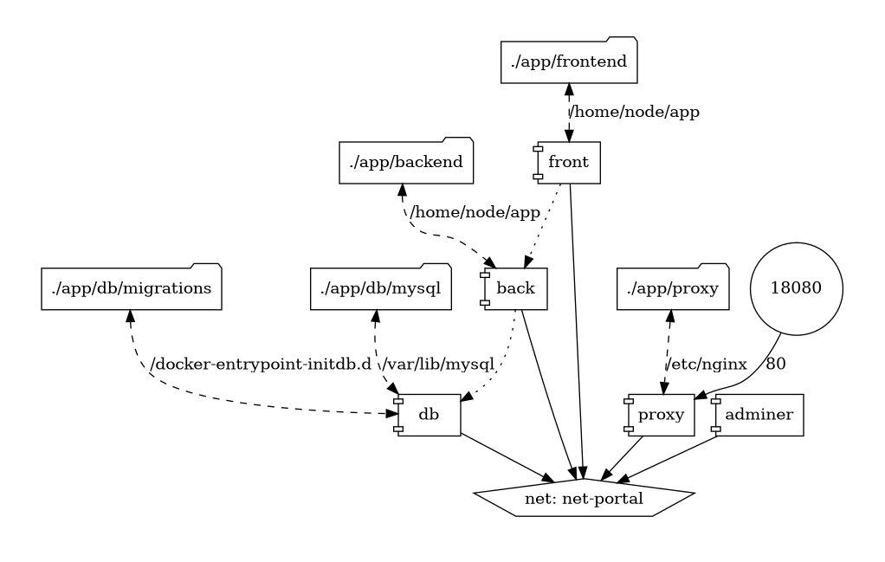

# Sitio web codaltec.com

Se compone de 5 contenedores:

- **db**: La base de datos *MySQL*
- **front**: Las vistas web, utiliza *NextJS*
- **back**: La lógica backend, conexiones a base de datos, utiliza *Typescript*
- **proxy**: Un servidor Nginx que centraliza las peticiones web.
- **adminer**: Un administrador web para la base de datos

Para acceder al servidor Nginx: http://localhost:18080

Las peticiones a `/api` se enviarán internamente al contenedor de *backend*, el resto irá al contenedor de *frontend*.

## Requisitos para despliegue de los contenedores

El sistema operativo debe tener instalados estos paquetes:

- Git
- Docker

## Desplegar aplicación

Se debe clonar el contenido del repositorio de código fuente:

```sh
git clone git@github.com:catd/facsat.git
cd facsat
````

Por defecto se trabaja la rama "master", si se quiere trabajar otra, en este caso "develop", se ejecuta:

```sh
git checkout develop
```

Se deben crear los archivos con las variables de entorno dentro de la carpeta que contiene los proyectos (`/app`), se pueden tomar como base los archivos con extensión `.example`:

- `./app/env.db`: Variables de entorno para el contenedor de la base de datos

    ```sh
    MYSQL_ROOT_PASSWORD=mysql_root_password
    MYSQL_DATABASE=mysql_database
    ```

- `./app/env.back`: Variables de entorno para el contenedor del backend

    ```sh
    NODE_ENV=dev
    PORT=3000
    DB_USER=db_user
    DB_PASSWORD=db_password
    DB_HOST=db_host
    DB_NAME=db_name
    DB_PORT=3306
    MAIL_NODEMAILER=usuario@codaltec.com
    PASS_NODEMAILER=3333444455556666
    ```

- `./app/env.front`: Variables de entorno para el contenedor del frontend

    ```sh
    NODE_ENV=dev
    PORT=3000
    DB_USER=db_user
    DB_PASSWORD=db_password
    DB_HOST=db_host
    DB_NAME=db_name
    DB_PORT=3306
    MAIL_NODEMAILER=usuario@codaltec.com
    PASS_NODEMAILER=3333444455556666
    ```

Y adicional a los anteriores archivos con variables de entorno, existe otro que aplica para la mayoría de los contenedores:


- `./app/env.global`: Variables para todos los contenedores.

    ```sh
    HOST_URL=http://localhost:18080
    ```

El contenedor *adminer* expone una aplicación web en: https://localhost:18081

## Topología:



## Configuración Nginx:

Para asegurar el tráfico y servir la aplicación desde el servidor VPS se utiliza esta configuración:

```
server {
    listen 80;
    server_name qa.codaltec.com;

    return 301 https://$host$request_uri;
}

server {
    listen 443 ssl;
    server_name qa.codaltec.com;

    include /etc/nginx/ssl-config.conf;

    http2   on;

    location / {
        proxy_pass http://localhost:18080;
        proxy_http_version 1.1;
        proxy_set_header Upgrade $http_upgrade;
        proxy_set_header Connection "upgrade";
        proxy_set_header Host $host;
        proxy_set_header X-Real-IP $remote_addr;
        proxy_set_header X-Forwarded-For $proxy_add_x_forwarded_for;
        proxy_set_header X-Forwarded-Proto $scheme;
    }

    error_page 500 502 503 504 /50x.html;
    location = /50x.html {
        root /usr/share/nginx/html;
    }
}
````

## Despliegue automático

En el repositorio se incluye el script `autodeploy.sh` que debe ser configurado para que se ejecute mediante un cron en el servidor.

Si por ejemplo se quiere verificar cada 5 minutos si hay cambios en el código fuente:

```sh
*/5 * * * * /bin/sh /home/bbtpwzmy/containers/codaltec-website/autodeploy.sh
```

Nota: El script verifica si hay cambios pendientes por desplegar y, únicamente, si es así los descarga en el servidor y reconstruye los contenedores. Es importante verificar la rama git que se está usando en la ruta de despliegue, para esto se ejecuta `git branch` y en el resultado del comando se mostrará (antecedida por un asterisco) la rama que está en uso.

## Administración web de la base de datos

Existe un contenedor que despliega la aplicación "Adminer" y es accesible a traves de la ruta "/adminer" del sitio, en ambiente local sería http://localhost:18080/adminer

Por seguridad se requiere un usuario y contraseña para poder ver la aplicación y una vez se haya esa información se mostrará la interfaz de *adminer*, los datos para conectar a la base de datos corresponden a los del contenedor:

- Moto de base de datos: `MySQL`
- Servidor: `db-web`
- Usuario: `root`
- Contraseña: `MYSQL_ROOT_PASSWORD`
- Base de datos: `MYSQL_DATABASE`

