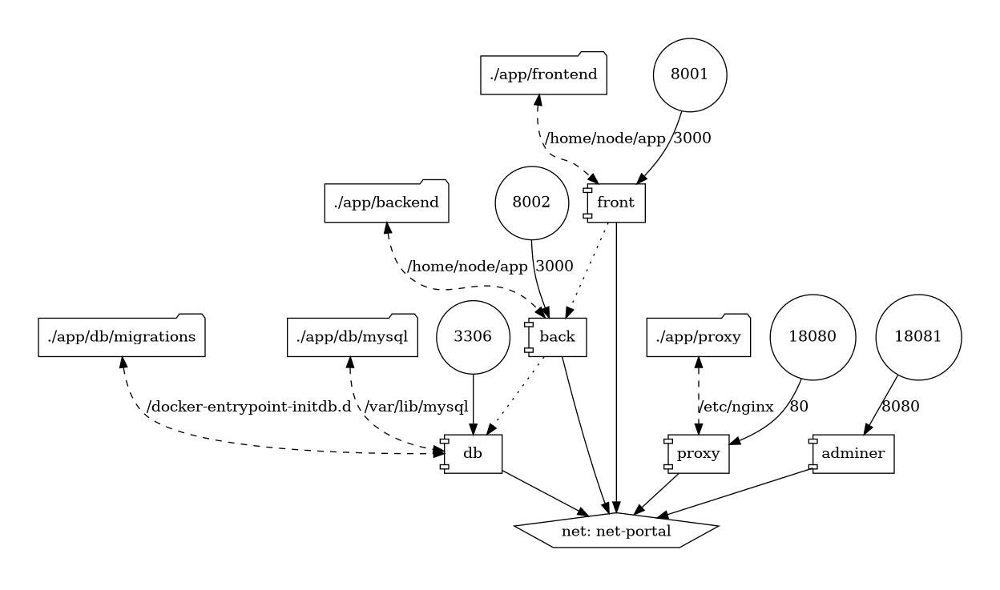
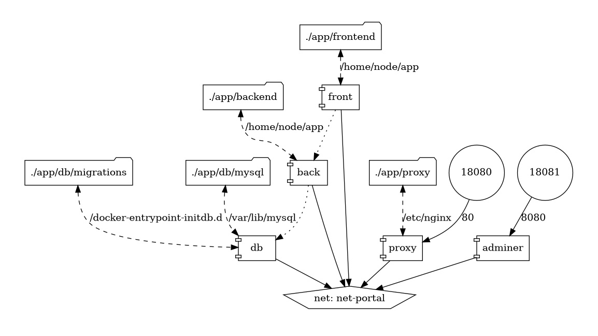

# Sitio web codaltec.com

Se compone de 4 contenedores:

- **db**: La base de datos *MySQL*
- **front**: Las vistas web, utiliza *NextJS*
- **back**: La lógica backend, conexiones a base de datos, utiliza *Typescript*
- **proxy**: Un servidor Nginx que centraliza las peticiones web.
- **adminer**: Un administrador web para la base de datos

Para acceder al servidor Nginx: http://localhost:18080

Las peticiones a `/api` se enviarán internamente al contenedor de *backend*, el resto irá al contenedor de *frontend*.

Se deben crear los archivos con las variables de entorno dentro de la carpeta que contiene los proyectos (`/app`), se pueden tomar como base los archivos con extensión `.example`:

- `env.db`: Variables de entorno para el contenedor de la base de datos
- `env.back`: Variables de entorno para el contenedor del backend
- `env.front`: Variables de entorno para el contenedor del frontend

El contenedor *adminer* expone una aplicación web en: https://localhost:18081

## Topología:

QA:

Producción:

